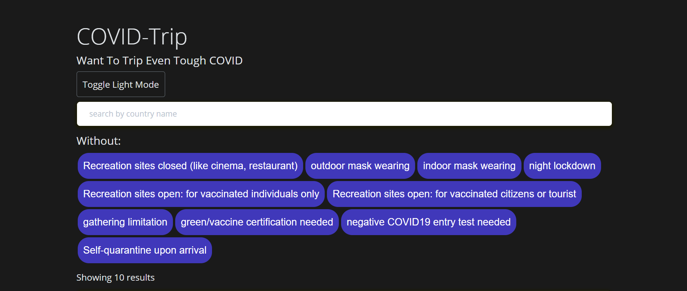
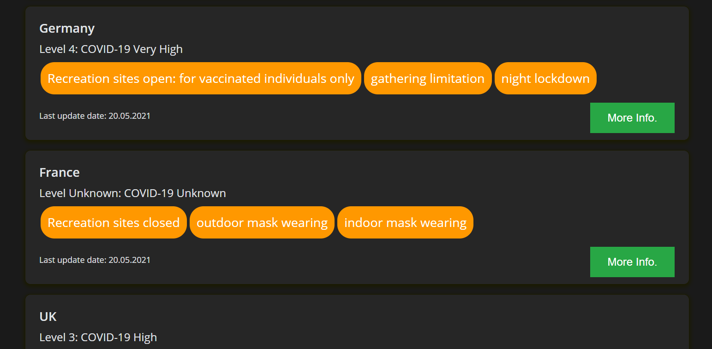

# COVID19 web-app app for tourists- Huji Hackaton

This web application is developed in order to help tourist find information about COVID19
restrictions in different countries accross the planet. One can filter countries according
to the restrictions unwanted by him.

